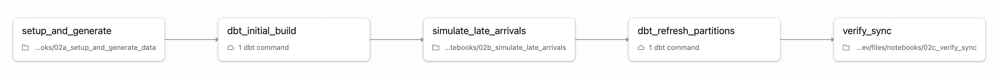

# dbt-databricks' `insert_overwrite` strategy Demo for Databricks

[](https://www.getdbt.com/)
[](https://www.databricks.com/)

> **⚠️ IMPORTANT:** Before deploying this project, please review the [**Configuration Requirements**](#️-configuration-requirements) section below and update `databricks.yml` with your workspace URL, SQL Warehouse ID, catalog, and schema. The project will not work with the placeholder values!

Databricks now natively supports dynamic partition overwrite mode without requiring the Spark Conf `spark.sql.sources.partitionOverwriteMode=dynamic`, and it works seamlessly in both Serverless Jobs and Serverless SQL.

This repository demonstrates dynamic partition overwrites on Databricks using two approaches:

1. **Pure SQL (REPLACE USING)**: Native Databricks SQL syntax for dynamic overwrites - see `notebooks/01_sql_replace_using_demo.ipynb` for a standalone SQL-based demo
2. **dbt `insert_overwrite` Strategy**: A complete dbt workflow running entirely on Databricks Serverless SQL, showcasing both traditional partitioned tables and modern Liquid Clustered tables

Whether you prefer pure SQL or dbt, this repo provides comprehensive examples of efficient, partition-level data refreshes.

### Key Takeaways:

1. **No Spark conf needed** - `spark.sql.sources.partitionOverwriteMode=dynamic` is NOT required
2. **All data layouts** - Partitioned tables as well as Liquid Clustered tables
3. **Works on Serverless** - Both Serverless Jobs and Serverless SQL support this natively
4. **Automatic detection** - Databricks automatically determines which partitions/clusters to overwrite based on the data

**Key References:**

- [Databricks Dynamic Partition Overwrites](https://docs.databricks.com/aws/en/delta/selective-overwrite#dynamic-partition-overwrites-with-replace-using) - REPLACE USING implementation
- [dbt insert_overwrite Strategy](https://docs.getdbt.com/docs/build/incremental-strategy#insert_overwrite) - SQL-based incremental strategy

## 📋 Table of Contents

- [Overview](#overview)
- [Features](#features)
- [Architecture](#architecture)
- [Prerequisites](#prerequisites)
- [Configuration Requirements](#️-configuration-requirements)
- [Quick Start](#quick-start)
- [Project Structure](#project-structure)
- [Key Concepts](#key-concepts)
- [Deployment](#deployment)
- [Usage](#usage)
- [Testing](#testing)
- [Sample Data](#sample-data)

## 🎯 Overview

This project demonstrates the **`insert_overwrite incremental strategy`** in dbt for Databricks, comparing two modern table formats:

1. **Partitioned Tables**: Traditional date-based partitioning with partition-level overwrites
2. **Liquid Clustered Tables**: Next-generation clustering without explicit partitions

### What is insert_overwrite?

`insert_overwrite` is a dbt incremental strategy ([dbt docs](https://docs.getdbt.com/docs/build/incremental-strategy#insert_overwrite)) that:

- Translates to `INSERT OVERWRITE` or `REPLACE WHERE` SQL statements
- Works with Databricks SQL (runs on SQL Warehouse)
- **Does NOT** use `spark.sql.sources.partitionOverwriteMode=dynamic` (not supported in Databricks SQL)
- Implements [Databricks Dynamic Partition Overwrites](https://docs.databricks.com/aws/en/delta/selective-overwrite#dynamic-partition-overwrites-with-replace-using)
- Replaces data matching specific criteria (partitions or predicates)
- Leaves other data untouched
- Provides idempotent, efficient incremental processing
- Perfect for daily batch workflows with automatic partition detection

## ✨ Features

- ✅ **Two Table Strategies**: Compare partitioned vs liquid clustered approaches
- ✅ **Complete dbt Project**: Production-ready models with tests and documentation
- ✅ **Sample Data Generation**: Realistic sales order data for testing
- ✅ **Databricks Asset Bundles**: Multi-environment deployment (dev/staging/prod)
- ✅ **Parameterized Jobs**: Catalog and schema configurable via job parameters
- ✅ **Pre-commit Hooks**: Code quality checks with sqlfluff, black, and isort
- ✅ **Comprehensive Documentation**: Inline docs and generated dbt documentation

## 🏗️ Architecture

```
┌─────────────────────────────────────────────────────────────┐
│                    Source Data Layer                        │
│  ┌──────────────────────────────────────────────────────┐  │
│  │  orders_partitioned (PARTITIONED BY order_date)     │  │
│  │  orders_liquid (CLUSTER BY order_date)              │  │
│  │  - 20,000 sample orders (identical data)            │  │
│  │  - 90 days of historical data                       │  │
│  │  - Multiple customers, products, statuses           │  │
│  └──────────────────────────────────────────────────────┘  │
└─────────────────────────────────────────────────────────────┘
                            ↓
┌─────────────────────────────────────────────────────────────┐
│                    Staging Layer (Views)                    │
│  ┌──────────────────────────────────────────────────────┐  │
│  │  stg_orders_partitioned / stg_orders_liquid         │  │
│  │  - Data cleaning and basic transformations          │  │
│  │  - Derived fields (year, month, day_of_week)       │  │
│  │  - Data quality flags                               │  │
│  └──────────────────────────────────────────────────────┘  │
└─────────────────────────────────────────────────────────────┘
                            ↓
┌─────────────────────────────────────────────────────────────┐
│                 Marts Layer (Incremental)                   │
│  ┌───────────────────────────┐  ┌──────────────────────┐  │
│  │ orders_mart_partitioned   │  │ orders_mart_liquid   │  │
│  │                           │  │                      │  │
│  │ Strategy: insert_overwrite│  │ Strategy: insert_    │  │
│  │ Partition: order_date     │  │ overwrite            │  │
│  │                           │  │ Liquid Cluster:      │  │
│  │ Use Case:                 │  │ order_date           │  │
│  │ - Daily aggregations      │  │                      │  │
│  │ - Time-series analysis    │  │ Use Case:            │  │
│  │ - Partition-level refresh │  │ - Daily aggregations │  │
│  │                           │  │ - Predicate refresh  │  │
│  └───────────────────────────┘  │ - Flexible layout    │  │
│                                  └──────────────────────┘  │
└─────────────────────────────────────────────────────────────┘
```

## 📦 Prerequisites

### Required Tools (Minimal Setup)

- **Databricks CLI**: Latest version (only requirement for YAML-based DABs!)
- **Databricks Workspace**: With Unity Catalog enabled
- **SQL Warehouse**: For dbt execution

### Optional Tools (For Python-defined DABs)

- **Python**: 3.12 (for future Python-defined DABs conversion)
- **uv**: For dependency management (alternative: pip, poetry)
- **Dependencies**: databricks-bundles, databricks-sdk, pydantic (in pyproject.toml)
- **dbt-databricks**: For local dbt development/testing (optional)

### Required Permissions

- Create catalogs and schemas
- Create and manage tables
- Run SQL Warehouse queries
- Deploy Databricks Asset Bundles

## ⚙️ Configuration Requirements

### **IMPORTANT: Required Configuration Before Deployment**

Before deploying this project, you **MUST** update the following configuration values in `databricks.yml`.

**Note on Variable Precedence:** The global `variables` section (lines 13-28) defines defaults for all environments. These values are used unless overridden by environment-specific settings. For simplicity, we've removed redundant environment-specific overrides - just update the global defaults below:

#### 1. Workspace Configuration (Line 32-33)

```yaml
workspace:
  host: "https://your-workspace.cloud.databricks.com" # ← UPDATE THIS
  root_path: "/Workspace/Users/user.name@company.com/insert_overwrite__databricks_dbt/${bundle.environment}" # ← UPDATE THIS
```

**Required changes:**

- **`host`**: Replace with your Databricks workspace URL
  - Example: `https://your-workspace.cloud.databricks.com`
  - Find this in your browser URL when logged into Databricks
- **`root_path`**: Replace the username with your Databricks username
  - Keep the folder structure: `/Workspace/Users/YOUR_USERNAME/insert_overwrite__databricks_dbt/${bundle.environment}`

#### 2. SQL Warehouse ID (Line 22-24)

```yaml
warehouse_id:
  description: "SQL Warehouse ID for dbt execution (SQL tasks only)"
  default: "abc123def4567890" # ← UPDATE THIS
```

**Required changes:**

- **`warehouse_id`**: Replace with your SQL Warehouse ID
  - Find this in Databricks: **SQL Warehouses** → Select your warehouse → Copy the ID from the URL or details page
  - Format: A 16-character alphanumeric string (e.g., `abc123def4567890`)

#### 3. Catalog and Schema (Line 14-20)

```yaml
catalog:
  description: "Unity Catalog name"
  default: "main" # ← UPDATE THIS

schema:
  description: "Schema name"
  default: "your_schema" # ← UPDATE THIS
```

**Required changes:**

- **`catalog`**: Replace with your Unity Catalog name
  - Find this in Databricks: **Data** → **Catalogs** → Select or create your catalog
  - Example: `main`, `dev_catalog`, `prod_catalog`, etc.
- **`schema`**: Replace with your schema name
  - This is where all tables will be created
  - Find this in Databricks: Within your catalog, select or create a schema
  - Example: `analytics`, `dev_analytics`, `prod_data`, etc.

---

**⚠️ Without these changes, deployment will fail or use incorrect resources!**

---

#### Advanced: Environment-Specific Overrides (Optional)

If you need **different values for different environments** (e.g., different warehouses for dev/staging/prod), you can override the global defaults by adding environment-specific variables:

```yaml
environments:
  dev:
    default: true
    mode: development
    variables:
      catalog:
        default: "dev_catalog"       # Override for dev only
      schema:
        default: "dev_schema"        # Override for dev only
      warehouse_id:
        default: "dev_warehouse_id"  # Override for dev only

  prod:
    mode: production
    variables:
      catalog:
        default: "prod_catalog"      # Override for prod only
      schema:
        default: "prod_schema"       # Override for prod only
      warehouse_id:
        default: "prod_warehouse_id" # Override for prod only
```

**Precedence Order:** Environment-specific variables override global defaults. If not specified in the environment, global defaults are used.

---

## 🚀 Quick Start

### YAML-based DABs Setup (Current - Production Ready!)

**⚠️ BEFORE YOU START:** Make sure you've completed the [Configuration Requirements](#️-configuration-requirements) section above to update `databricks.yml` with your workspace URL, username, and SQL Warehouse ID!

#### 1. Install Databricks CLI

```bash
# Install Databricks CLI (one-time setup)
curl -fsSL https://raw.githubusercontent.com/databricks/setup-cli/main/install.sh | sh
```

#### 2. Clone and Authenticate

```bash
git clone <your-repo-url>
cd insert_overwrite__databricks_dbt

# Authenticate to Databricks workspace
databricks auth login --host https://your-workspace.cloud.databricks.com
```

#### 3. Deploy to Dev Environment

```bash
# Validate bundle configuration
databricks bundle validate

# Deploy to development
databricks bundle deploy -t dev
```

#### 4. Run Complete Workflow (One Command!)

```bash
# Run the complete dbt insert_overwrite demo workflow
# This single job orchestrates: setup → dbt → simulate → dbt → verify
databricks bundle run dbt_workflow -t dev
```

This consolidated workflow will:

1. **Setup (02a)**: Create source tables and generate 20,000 sample orders
2. **Initial dbt build**: Run all dbt models with insert_overwrite (first time = full load)
3. **Simulate late arrivals (02b)**: Add 50 new orders to automatically calculated dates
   - Notebook auto-detects data range and selects 3 dates (20%, 50%, 80% through the range)
   - Works in any month/year without hardcoded dates!
   - Shows BEFORE/AFTER counts in source tables
   - Demonstrates that mart tables are now OUT OF SYNC
4. **Dynamic refresh with insert_overwrite**: dbt automatically detects and refreshes ONLY the affected dates!
   - ✅ Processes ALL source data and aggregates by order_date
   - ✅ insert_overwrite automatically detects which partitions exist in the result
   - ✅ Overwrites ONLY those 3 partitions (not all 90+ days!)
   - ✅ No filters, no explicit dates - completely data-driven!
   - ✅ Mart tables back in sync with minimal processing
5. **Verify synchronization (02c)**: Confirms:
   - ✅ Source and mart table counts match for affected dates
   - ✅ Only target dates were refreshed (check `last_updated_at`)
   - ✅ Other dates remain unchanged
   - ✅ Complete proof that dynamic partition overwrite worked correctly!

**Workflow DAG Visualization:**



The diagram above shows the complete task orchestration with dependencies, demonstrating how the workflow executes in sequence with proper task chaining.

That's it! Everything runs on Databricks. No local Python/dbt needed.

---

### Why YAML-based DABs?

- ✅ **Simpler** - Clean, declarative syntax for dbt workflows
- ✅ **Production Ready** - Better validator support, no workarounds needed
- ✅ **No Dependencies** - Only Databricks CLI required locally
- ✅ **Reliable** - Direct warehouse_id support for dbt tasks
- ✅ **Maintainable** - Easier to understand for dbt use cases

## 📁 Project Structure

```
insert_overwrite__databricks_dbt/
├── README.md                           # This file
├── databricks.yml                      # DABs main configuration (YAML-based)
├── dabs_steps.txt                      # Quick command reference
├── INSERT_OVERWRITE_EXAMPLES.md        # Usage examples and demo workflow
├── dbt_workflow_dag.jpg                # Workflow DAG visualization
├── .gitignore                         # Git ignore rules
├── .env.example                       # Environment variables template
├── .pre-commit-config.yaml            # Pre-commit hooks configuration
├── pyproject.toml                      # Python dependencies
├── uv.lock                            # Dependency lock file
│
├── resources/                          # YAML-defined DABs resources
│   ├── dbt_workflow_job.yml           # Complete dbt workflow (setup → dbt → simulate → dbt → verify)
│   └── sql_replace_using_job.yml      # Pure SQL demo job (REPLACE USING)
│
├── dbt_project/                       # dbt project root
│   ├── dbt_project.yml               # dbt project configuration
│   ├── profiles.yml                  # dbt connection profiles
│   ├── .sqlfluff                     # SQL linting configuration
│   │
│   └── models/
│       ├── sources.yml               # Source table definitions
│       │
│       ├── staging/                  # Staging models (views)
│       │   ├── stg_orders.sql       # Staging transformation
│       │   └── stg_orders.yml       # Model documentation
│       │
│       └── marts/                    # Analytics-ready tables
│           ├── partitioned/          # Partitioned insert_overwrite models
│           │   ├── orders_mart_partitioned.sql
│           │   └── orders_mart_partitioned.yml
│           │
│           └── liquid_clustered/     # Liquid clustered models
│               ├── orders_mart_liquid.sql
│               └── orders_mart_liquid.yml
│
└── notebooks/                         # Databricks notebooks (ipynb)
    ├── 01_sql_replace_using_demo.ipynb   # Pure SQL demo using REPLACE USING (alternative to dbt)
    ├── 02a_setup_and_generate_data.ipynb # Create source tables and generate data
    ├── 02b_simulate_late_arrivals.ipynb  # Simulate late-arriving data for demo
    └── 02c_verify_sync.ipynb             # Verify synchronization after insert_overwrite
```

**Notebook Naming Convention:**
The numbered prefix clarifies the execution order and logical grouping:

- **01**: SQL REPLACE USING demo (standalone alternative to dbt)
- **02a**: Setup and data generation (prerequisite for dbt workflow)
- **02b**: Simulate late arrivals (demo scenario for insert_overwrite)
- **02c**: Verify synchronization (validation after dbt run)

## 🔑 Key Concepts

### Partitioned insert_overwrite

**Model**: `orders_mart_partitioned`

```sql
{{
    config(
        materialized='incremental',
        incremental_strategy='insert_overwrite',
        partition_by='order_date'
    )
}}
```

**How it works**:

- Data partitioned by `order_date`
- Process ALL source data and aggregate by `order_date`
- `insert_overwrite` automatically detects which partitions exist in the result
- Only those partitions are overwritten - historical partitions remain untouched
- Completely data-driven, no filters needed

**Benefits**:

- ✅ Efficient partition pruning
- ✅ Predictable query performance
- ✅ Idempotent daily processing
- ✅ Easy to reprocess specific dates

**Trade-offs**:

- ⚠️ Limited to low-cardinality partition columns
- ⚠️ Partition metadata overhead
- ⚠️ Less flexible for varied query patterns

### Liquid Clustered insert_overwrite

**Model**: `orders_mart_liquid`

```sql
{{
    config(
        materialized='incremental',
        incremental_strategy='insert_overwrite',
        liquid_clustered_by='order_date'
    )
}}
```

**How it works**:

- No explicit partitions
- Data organized by `order_date` clustering (liquid clustering)
- Process ALL source data and aggregate by `customer_id, order_date`
- `insert_overwrite` uses predicates to replace rows with matching `order_date` values
- Completely data-driven, automatic optimization

**Benefits**:

- ✅ Same use case as partitioned table (date-based aggregations)
- ✅ Flexible query patterns
- ✅ No partition metadata overhead
- ✅ Automatic data layout optimization
- ✅ Modern alternative to traditional partitioning

**Trade-offs**:

- ⚠️ Requires Databricks Runtime 13.3+
- ⚠️ Different mental model vs partitioning
- ⚠️ Predicate specification important

## 🚀 Deployment

### Environment Configuration

The project supports three environments:

| Environment | Catalog           | Schema Prefix              | Mode        |
| ----------- | ----------------- | -------------------------- | ----------- |
| Dev         | `dev_catalog`     | `insert_overwrite_dev`     | development |
| Staging     | `staging_catalog` | `insert_overwrite_staging` | development |
| Prod        | `prod_catalog`    | `insert_overwrite_prod`    | production  |

### Deploy to Different Environments

```bash
# Development
databricks bundle deploy -t dev
databricks bundle run dbt_workflow -t dev

# Staging
databricks bundle deploy -t staging
databricks bundle run dbt_workflow -t staging

# Production
databricks bundle deploy -t prod
databricks bundle run dbt_workflow -t prod
```

### Customize Parameters

Edit `databricks.yml` to customize:

```yaml
variables:
  catalog: "your_catalog"
  schema_prefix: "your_prefix"
  warehouse_id: "your_warehouse_id"
```

## 📖 Usage

### Run dbt Models Locally

```bash
cd dbt_project

# Set environment variables
export DBT_CATALOG="dev_catalog"
export DBT_SCHEMA="insert_overwrite_dev"
export DATABRICKS_HOST="https://your-workspace.cloud.databricks.com"
export DATABRICKS_HTTP_PATH="/sql/1.0/warehouses/your_warehouse_id"
export DATABRICKS_TOKEN="your_token"

# Run models
dbt run

# Run only partitioned models
dbt run --select marts.partitioned.*

# Run only liquid clustered models
dbt run --select marts.liquid_clustered.*

# Run tests
dbt test

# Generate documentation
dbt docs generate
dbt docs serve
```

### Run via Databricks Jobs

```bash
# Run complete workflow (recommended - runs all steps)
databricks bundle run dbt_workflow

# Run SQL REPLACE USING demo (standalone alternative to dbt)
databricks bundle run sql_replace_using
```

## 🧪 Testing

### Run dbt Tests

```bash
cd dbt_project

# Run all tests
dbt test

# Run tests for specific model
dbt test --select orders_mart_partitioned

# Run only data tests
dbt test --data

# Run only schema tests
dbt test --schema
```

### Test Coverage

The project includes:

- **Not null tests**: Key columns
- **Unique tests**: Primary keys
- **Relationship tests**: Foreign keys
- **Accepted values tests**: Status columns
- **Custom tests**: Data quality checks
- **Expression tests**: Business logic validation

## 📊 Sample Data

The sample dataset includes:

- **20,000 orders** (configurable via notebook parameters)
- **~500 unique customers**
- **~100 unique products**
- **~90 days** of historical data (dynamically generated from first day of previous month to today)
- **5 order statuses**: delivered (60%), shipped (15%), confirmed (12%), pending (8%), cancelled (5%)
- **Identical data** in both source tables (orders_partitioned and orders_liquid)
- **Auto-calculated demo dates**: Simulate notebook selects 3 dates at 20%, 50%, 80% through the data range
